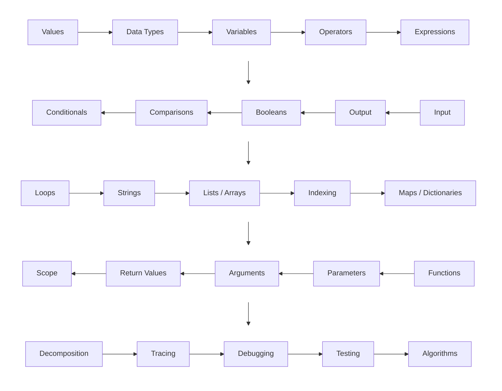

+++
title = "Fundamentals"
draft = false
weight = 30
+++

## Roadmap {#roadmap}

This is the roadmap of programming fundamentals taught to students.

```mermaid
flowchart TB

    subgraph R1[" "]
        direction LR
        A["Values"] --> B["Data Types"] --> C["Variables"] --> D["Operators"] --> E["Expressions"]
    end

    subgraph R2[" "]
        direction RL
        F["Input"] --> G["Output"] --> H["Booleans"] --> I["Comparisons"] --> J["Conditionals"]
    end

    subgraph R3[" "]
        direction LR
        K["Loops"] --> L["Strings"] --> M["Lists / Arrays"] --> N["Indexing"] --> O["Maps / Dictionaries"]
    end

    subgraph R4[" "]
        direction RL
        P["Functions"] --> Q["Parameters"] --> R["Arguments"] --> S["Return Values"] --> T["Scope"]
    end

    subgraph R5[" "]
        direction LR
        U["Decomposition"] --> V["Tracing"] --> W["Debugging"] --> X["Testing"] --> Y["Algorithms"]
    end

    R1 --> R2
    R2 --> R3
    R3 --> R4
    R4 --> R5

    style R1 fill:none,stroke:none
    style R2 fill:none,stroke:none
    style R3 fill:none,stroke:none
    style R4 fill:none,stroke:none
    style R5 fill:none,stroke:none

    click A "/programming/teaching/fundamentals/values/" "Pieces of information that programs can work with."
    click B "/programming/teaching/fundamentals/data-types/" "Categories of values such as numbers, text, and booleans."
    click C "/programming/teaching/fundamentals/variables/" "Names used to store and refer to values."
    click D "/programming/teaching/fundamentals/operators/" "Symbols that perform operations on values."
    click E "/programming/teaching/fundamentals/expressions/" "Combinations of values and operators that produce new values."

    click F "/programming/teaching/fundamentals/input/" "How a program receives information from outside itself."
    click G "/programming/teaching/fundamentals/output/" "How a program communicates information and results."
    click H "/programming/teaching/fundamentals/booleans/" "True and false values used to represent logical states."
    click I "/programming/teaching/fundamentals/comparisons/" "Operations that compare values and produce boolean results."
    click J "/programming/teaching/fundamentals/conditionals/" "Choosing which instructions execute based on a condition."

    click K "/programming/teaching/fundamentals/loops/" "Repeating instructions while or until a condition is met."
    click L "/programming/teaching/fundamentals/strings/" "Sequences of characters used to represent and manipulate text."
    click M "/programming/teaching/fundamentals/lists-arrays/" "Ordered collections containing multiple values."
    click N "/programming/teaching/fundamentals/indexing/" "Accessing elements of a sequence by their position."
    click O "/programming/teaching/fundamentals/maps-dictionaries/" "Associating keys with corresponding values."

    click P "/programming/teaching/fundamentals/functions/" "Reusable sections of code that perform a particular task."
    click Q "/programming/teaching/fundamentals/parameters/" "Names that describe the inputs accepted by a function."
    click R "/programming/teaching/fundamentals/arguments/" "Actual values supplied when a function is called."
    click S "/programming/teaching/fundamentals/return-values/" "Values sent from a function back to its caller."
    click T "/programming/teaching/fundamentals/scope/" "The region of a program where a name can be accessed."

    click U "/programming/teaching/fundamentals/decomposition/" "Breaking a large problem into smaller manageable parts."
    click V "/programming/teaching/fundamentals/tracing/" "Following execution step by step to understand program state."
    click W "/programming/teaching/fundamentals/debugging/" "Finding, understanding, and correcting program errors."
    click X "/programming/teaching/fundamentals/testing/" "Checking that programs behave correctly across different cases."
    click Y "/programming/teaching/fundamentals/algorithms/" "Precise step-by-step procedures for solving computational problems."
```
