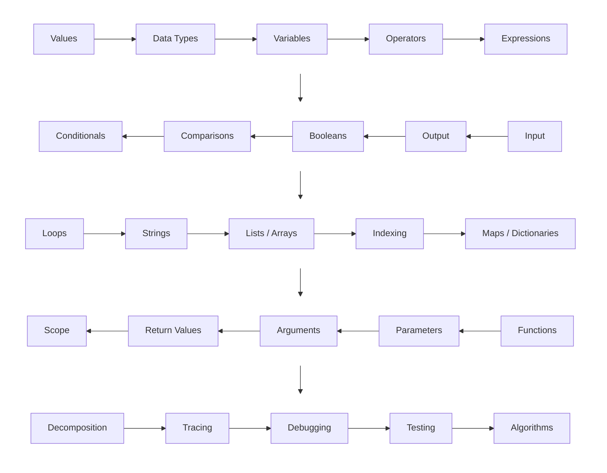

+++
title = "Fundamentals"
draft = false
weight = 30
+++

## Roadmap {#roadmap}

This is the roadmap of programming fundamentals taught to students.




## What About the First Programming Language? {#what-about-the-first-programming-language}

> [!NOTE]
> **Summary**
>
> The first programming language matters less than what comes after it.
>
> A student's first language should make programming approachable and give them enough motivation to build things. Python, Lua, JavaScript, Java, and even C or C++ can all serve that purpose in different situations.
>
> What matters more is that the student does not let one language define their entire understanding of programming. As they progress, they should encounter different programming models, type systems, data structures, memory models, and ways of organizing software.
>
> The recommendations below are therefore based on what I think provides the best foundation for general programming education, not on the idea that one language is universally superior.

The youngest students I have use Scratch before they develop their typing skills. When they are used to the keyboard, I would immediately switch them to Python or Lua.

Many students might choose Python as their first programming language because of its easy-to-remember syntax while following many conventions that transfer well to other programming languages. A student could also start with Java, especially if they want earlier exposure to static typing, classes, and the style of programming commonly used in large software projects but do not want to deal with manual memory management. Some young students choose Lua because they would like to work with Roblox. If the student wants to make a small website, JavaScript could be given a go. Or, as a trial by fire, a student could go directly to C or C++ (which I wouldn't recommend).

> [!TIP]
> **Python** for a general student, and Lua for a student who wants to directly make Roblox games. For a student who wants to directly make a website, I suggest JavaScript.

{}
I first learned programming through the Roblox Lua language to make some small Roblox games. I was partly motivated by wanting Robux to buy cosmetics and game passes or even make real money. Now that I'm older, I realize that my interests have moved far beyond Roblox. I could have stuck with Python because, compared to Lua or JavaScript, Python would have given me a more transferable foundation for the languages and computer science concepts I later encountered in C++.
{}


### Prefer Python For General Programming Education {#prefer-python-for-general-programming-education}

If a student wants to pursue computer science or software engineering seriously, I prefer languages whose concepts transfer easily to other mainstream languages. A beginner should not only learn syntax, but also develop mental models of variables, types, functions, data structures, objects, references, and program organization that remain useful when they eventually move to languages such as Java, C++, or Rust.


#### Lua {#lua}

This language has its weird quirks like indexing starting at 1 instead of 0 compared to most other languages.

Lua also uses tables in places where other languages distinguish arrays, maps (dictionaries), objects, and classes. As perhaps the worst transgression, even object-oriented behavior is built by extending ordinary tables with metatables.

In terms of broader educational and career prospects, I would eventually transition a student from Lua to Python as long as they are willing to leave behind making Roblox games. When they are ready for a more explicit (trading simplicity for control) language, they could then move to Java, C, or C++.

> [!DANGER]
> **Roblox Isn't the Best** (Might Be the Worst)
>
> I don't think students should approach Roblox development expecting to make money. Students can make games to learn basic problem solving in coding, but making a commercially successful game requires substantially more than learning how to script. Financially, eventually making one's own game outside of a game platform like Roblox or even one's own game engine guarantees maximal profits compared to 15-29% roughly of the revenue Roblox earns.
>
> Lua's tables combine several concepts that other languages conventionally distinguish, such as arrays, maps, objects, and class-like structures. A student who later moves to another language will therefore have to learn to distinguish concepts that Lua allowed them to treat as one general-purpose structure.
>
> Roblox can be a good motivation for learning programming, but it should not become the boundary of a young student's programming education.
>
> 


#### JavaScript {#javascript}

JavaScript can be a reasonable first programming language, but it is a poor language to learn programming exclusively through. Its unusual semantics (the rules determining what code means and how it behaves), browser-oriented history, and high-level abstractions can leave beginners with an incomplete mental model of how programming languages and computers generally work.

{}
```javascript
"5" + 1       // "51"
"5" - 1       // 4

[] == false   // true
typeof null   // "object"
```

These behaviors are manageable once someone understands JavaScript, but they are not rules I particularly want a beginner internalizing while they are still developing their understanding of values, types, and comparison.
{}
